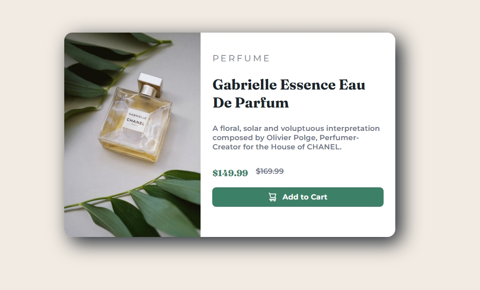

 ## Table of contents

- [Overview](#overview)
- [Screenshot](#screenshot)
  - [The challenge](#the-challenge)
- [My process](#my-process)
  - [Built with](#built-with)
  - [What I learned](#what-i-learned)
  - [Useful resources](#useful-resources)
- [Author](#author)
- [Acknowledgments](#acknowledgments)


## Overview

I built a product preview card component, showcasing a perfume product with responsive images, elegant typography, and a stylish "Add to Cart" button. The design is inspired by a challenge from Frontend Mentor.

This component demonstrates strong use of responsive design, accessible HTML structure, and modern CSS techniques to create a professional and elegant product card.

### Screenshot



### The challenge
## 1. Styling the button
Problem:
I struggled to make the icon and text align nicely inside the button. They weren't centered properly, and spacing was off.

## Why it happened:

I didn't include align-items: center and justify-content: center in the button's CSS.

I didn't add a gap to control space between the icon and text.

## How we fixed it:
- Added display: flex, align-items: center, justify-content: center, and gap: 15px to .button.
This ensures both the icon and text are perfectly centered and evenly spaced.

## 2. Responsive images for desktop and mobile
# Problem:
- I didn't know how to swap between a mobile image and a desktop image cleanly without using JavaScript.

## Why it happened:

- I didn't know about the <picture> element and the media attribute inside <source>.

- I mistakenly wrote media="(maxwidth:500px)" instead of media="(max-width: 500px)".

## How we fixed it:
- Used the <picture> tag with correct media query syntax:
```html
<picture>
  <source srcset="./images/image-product-mobile.jpg" media="(max-width: 500px)">
  
</picture>
```
- This automatically loads the correct image depending on the viewport size.

## 3.Image overflowing the parent container
# Problem:
- My image was overlapping the container and breaking the layout.


## Why it happened:

- I set max-inline-size incorrectly instead of using inline-size.

- I wasn't resetting the border-radius properly for mobile view.

## How we fixed it:
- Corrected to use inline-size instead of max-inline-size.
-  Used border-top-left-radius, border-top-right-radius, and          conditionally removed bottom radius for mobile using @media.


## My process

- HTML Structure: Built clean, semantic markup first, making sure to use appropriate tags and accessibility-friendly attributes.

- CSS Layout & Style: Started with desktop layout using Flexbox, added shadows, colors, and typography with Google Fonts.

- Responsive Design: Added @media queries to adjust layout and image styling on smaller screens.

- Image Responsiveness: Integrated the <picture> tag to handle mobile and desktop images seamlessly.

- Interactivity: Added a small JavaScript snippet to handle the "Add to Cart" alert on click.

- Debugging & Refining: Iterated on spacing, radius, shadows, and responsiveness to polish the final look.

### Built with

- Semantic HTML5 markup

- CSS custom properties and modern CSS techniques

- Flexbox for layout and centering

- Media queries (@media) for responsiveness

- <picture> element and srcset for responsive images

- Vanilla JavaScript for button click alert

### What I learned

- How to style buttons properly using Flexbox for icon and text alignment.

- How to use responsive images with <picture>, srcset, and media queries.

- How to write and fine-tune media queries in CSS.

- Correct use of inline-size and when to use max-inline-size.

- How to add icons inside buttons and keep them accessible and responsive.

- To see how you can add code snippets, see below:

```html
<h1>Some HTML code I'm proud of</h1>
```
```css
.proud-of-this-css {
  color: papayawhip;
}
```
```js
const proudOfThisFunc = () => {
  console.log('🎉')
}
```

### Continued development

Use this section to outline areas that you want to continue focusing on in future projects. These could be concepts you're still not completely comfortable with or techniques you found useful that you want to refine and perfect.


### Useful resources

- [Example resource 1](https://developer.mozilla.org/en-US/docs/Web/HTML/Guides/Responsive_images) - This detailed article on responsive images by MDN Web Docs.
- [Example resource 2](https://www.youtube.com/watch?v=QGb-W-c-gIM&list=PL4-IK0AVhVjOJs_UjdQeyEZ_cmEV3uJvx&index=48) - This helped clarify the use of @media queries in CSS by Kevin Powell youtube.


## Author

- Frontend Mentor - [jeff20501](https://www.frontendmentor.io/profile/jeff20501)
- Github - [jeff20501](https://github.com/jeff20501)


## Acknowledgments

- Kevin Powell — helped clarify the use of @media queries in CSS. His YouTube channel is an amazing resource for mastering CSS responsiveness.

- MDN Web Docs — for the detailed article on responsive images.

