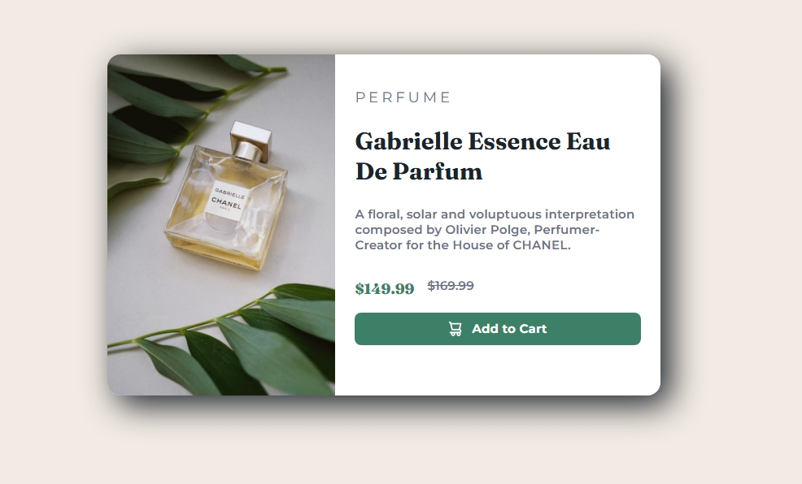

 ## Table of contents

- [Overview](#overview)
- [Screenshot](#screenshot)
  - [The challenge](#the-challenge)
- [My process](#my-process)
  - [Built with](#built-with)
  - [What I learned](#what-i-learned)
  - [Useful resources](#useful-resources)
- [Author](#author)
- [Acknowledgments](#acknowledgments)


## Overview

I built a product preview card component, showcasing a perfume product with responsive images, elegant typography, and a stylish "Add to Cart" button. The design is inspired by a challenge from Frontend Mentor.

This component demonstrates strong use of responsive design, accessible HTML structure, and modern CSS techniques to create a professional and elegant product card.

### Screenshot



### The challenge
## 1. Styling the button
Problem:
I struggled to make the icon and text align nicely inside the button. They weren't centered properly, and spacing was off.

## Why it happened:

I didn't include align-items: center and justify-content: center in the button's CSS.

I didn't add a gap to control space between the icon and text.

## How we fixed it:
- Added display: flex, align-items: center, justify-content: center, and gap: 15px to .button.
This ensures both the icon and text are perfectly centered and evenly spaced.

## 2. Responsive images for desktop and mobile
# Problem:
- I didn't know how to swap between a mobile image and a desktop image cleanly without using JavaScript.

## Why it happened:

- I didn't know about the <picture> element and the media attribute inside <source>.

- I mistakenly wrote media="(maxwidth:500px)" instead of media="(max-width: 500px)".

## How we fixed it:
- Used the <picture> tag with correct media query syntax:
```html
<picture>
  <source srcset="./images/image-product-mobile.jpg" media="(max-width: 500px)">
  
</picture>
```
- This automatically loads the correct image depending on the viewport size.

## 3.Image overflowing the parent container
# Problem:
- My image was overlapping the container and breaking the layout.


## Why it happened:

- I set max-inline-size incorrectly instead of using inline-size.

- I wasn't resetting the border-radius properly for mobile view.

## How we fixed it:
- Corrected to use inline-size instead of max-inline-size.
-  Used border-top-left-radius, border-top-right-radius, and          conditionally removed bottom radius for mobile using @media.


## My process

- HTML Structure: Built clean, semantic markup first, making sure to use appropriate tags and accessibility-friendly attributes.

- CSS Layout & Style: Started with desktop layout using Flexbox, added shadows, colors, and typography with Google Fonts.

- Responsive Design: Added @media queries to adjust layout and image styling on smaller screens.

- Image Responsiveness: Integrated the <picture> tag to handle mobile and desktop images seamlessly.

- Interactivity: Added a small JavaScript snippet to handle the "Add to Cart" alert on click.

- Debugging & Refining: Iterated on spacing, radius, shadows, and responsiveness to polish the final look.

### Built with

- Semantic HTML5 markup

- CSS custom properties and modern CSS techniques

- Flexbox for layout and centering

- Media queries (@media) for responsiveness

- <picture> element and srcset for responsive images

- Vanilla JavaScript for button click alert

### What I learned

- How to style buttons properly using Flexbox for icon and text alignment.

- How to use responsive images with <picture>, srcset, and media queries.

- How to write and fine-tune media queries in CSS.

- Correct use of inline-size and when to use max-inline-size.

- How to add icons inside buttons and keep them accessible and responsive.

- To see how you can add code snippets, see below:

```html
<h1>Some HTML code I'm proud of</h1>
```
```css
.proud-of-this-css {
  color: papayawhip;
}
```
```js
const proudOfThisFunc = () => {
  console.log('🎉')
}
```


### Useful resources

- [Example resource 1](https://developer.mozilla.org/en-US/docs/Web/HTML/Guides/Responsive_images) - This detailed article on responsive images by MDN Web Docs.
- [Example resource 2](https://www.youtube.com/watch?v=QGb-W-c-gIM&list=PL4-IK0AVhVjOJs_UjdQeyEZ_cmEV3uJvx&index=48) - This helped clarify the use of @media queries in CSS by Kevin Powell youtube.


## Author

- Frontend Mentor - [jeff20501](https://www.frontendmentor.io/profile/jeff20501)
- Github - [jeff20501](https://github.com/jeff20501)


## Acknowledgments

- Kevin Powell — helped clarify the use of @media queries in CSS. His YouTube channel is an amazing resource for mastering CSS responsiveness.

- MDN Web Docs — for the detailed article on responsive images.

